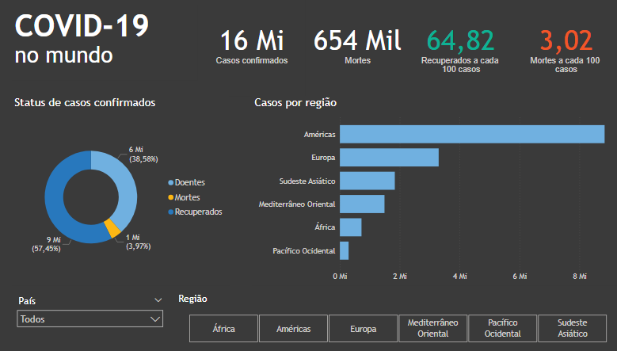

# 📊 Roteiro 4

## Conjunto de dados

`covid.xlsx`

> Fonte: adaptado de https://www.kaggle.com/datasets/imdevskp/corona-virus-report/data

## Exercício 1

Observe o relatório apresentado na figura abaixo e responda:

1. Qual é o visual utilizado para apresentar as informações numéricas no topo do relatório?
2. Qual é o tipo de gráfico utilizado para mostrar o status dos casos confirmados? Esse tipo de gráfico é uma boa escolha? Por quê?
3. Qual é o tipo de gráfico utilizado para mostrar o número de casos por região? Esse tipo de gráfico é uma boa escolha? Por quê?
4. Qual é o visual utilizado para filtrar o relatório por país? E por região? No que esses visuais diferem? Qual é o parâmetro de configuração que resulta nessa diferença? 

## Exercício 2

1. Crie um relatório em branco no Power BI;
2. Carregue o conjunto de dados `covid.xlsx`;
3. Reproduza o relatório apresentado na figura do exercício 1;
4. Qual outra informação seria interessante apresentar no relatório? Escolha o tipo de gráfico adequado para apresentá-la, justificando a sua resposta. Em seguida, adicione o gráfico escolhido ao relatório.
